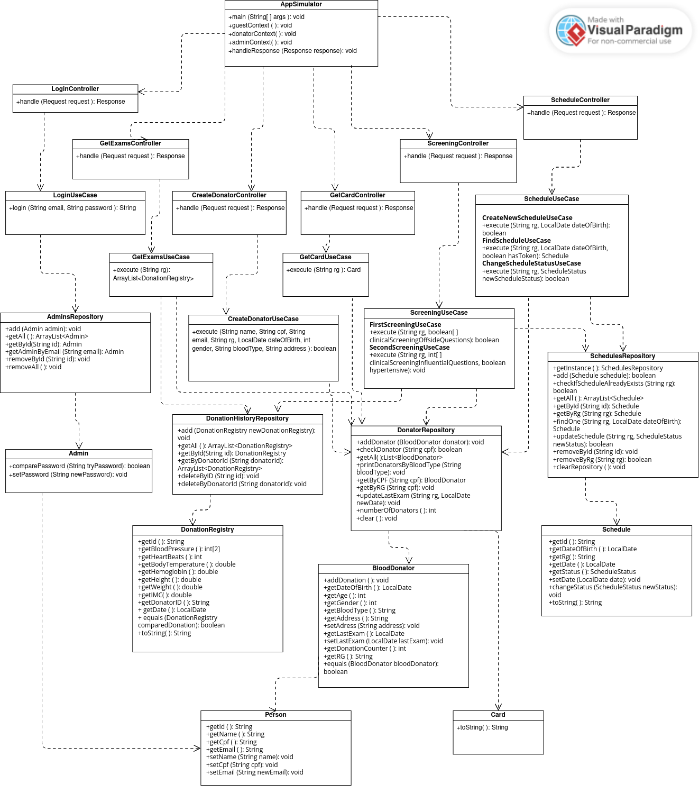

# HSS 

O Hemoce System Simulator (HSS) é um simulador do sistema do Hemoce criado como projeto da cadeira
de Programação Orientada a Objetos (POO). Ele possibilita o acesso a uma conta própria e única a cada
doador, e ao administrador o gerenciamento e a manipulação destas contas.

Assim sendo, o sistema deverá conter dois módulos. Ambos os módulos serão acessados através de um
login,utilizando o Registro Geral (RG) do usuário e sua Data de Nascimento; entretanto, o administrador terá
que logar através de uma senha própria. O primeiro módulo, acessível ao doador, permitirá que ele tenha
acesso aos seus dados, aos históricos dos exames realizados durante as triagens, à sua carteirinha de doador
virtual, bem como que solicite agendamentos para doação, ou caso seja doador de 1a vez, ele também terá
como realizar um agendamento e seu cadastro. O segundo módulo será a conta acessível apenas pelo admin e
possibilitará a criação de cadastros, atualizações cadastrais das contas dos doadores, e o gerenciamento dos
agendamentos.

O projeto será escrito no modelo de um servidor Web e terá duas partes, para ambas as entregas. A primeira
será criado apenas um “simulador” da web via CLI, implementando alguns conceitos de forma muito
simplória. Já na segunda, é esperado que seja implementado um servidor de fato, utilizando-se de
frameworks robustos disponíveis, como o Spring Boot.

A ideia do sistema foi desenvolvida pela própria equipe em conjunto, e tem como inspiração o processo de
doação e o funcionamento do sistema do Hemoce. A equipe concluiu que implementar o HSS seria uma
forma interessante de aprender e fixar os conceitos apresentados na disciplina, bem como outros adquiridos
além.

## Diagrama de classes

As classes buscam imitar uma sequência de ações que ocorrem em uma comunicação entre o Cliente e um
Servidor, implementando os conceitos Web de forma simples, seguindo levemente uma arquitetura limpa,
com Controllers, UseCases, Repositórios e Entidades. O fluxo básico da aplicação começa do App, que se
comunica com os Controllers através de uma Request, que por sua vez se comunicam com os UseCases,que realizam as operações nas Entidades por intermédio dos Repositórios. Quando tudo estiver concluído,
seja com sucesso ou com falha, o Controller retorna uma Response para o App, que a mostra formatada ao
usuário.

